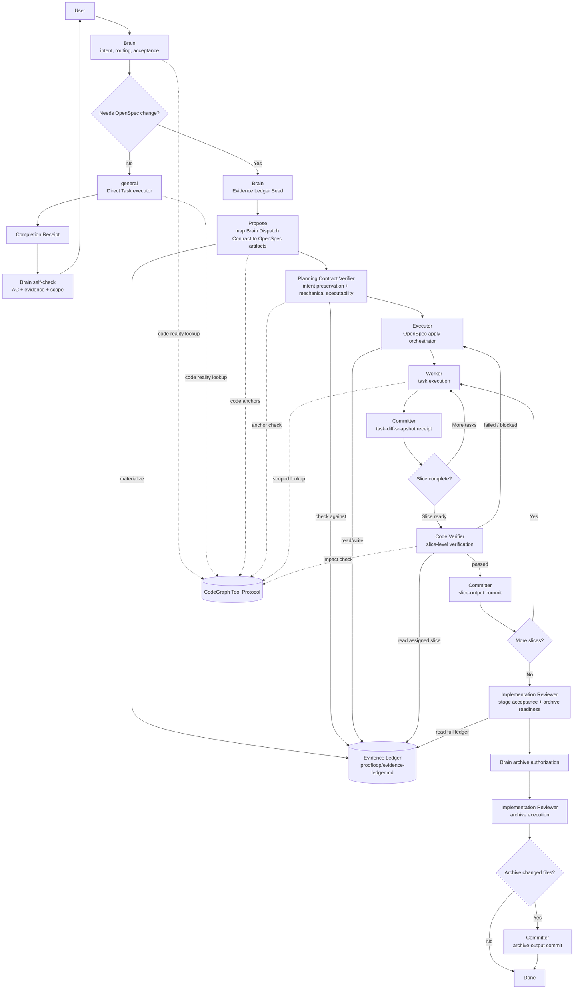

# ProofLoop

ProofLoop is a proof-first OpenCode + OpenSpec workflow that keeps user intent under Brain control while making downstream planning, execution, verification, git boundary closure, and archive mechanical.

> Brain owns intent.  
> Subagents execute mechanically.  
> Completion must be provable against Brain's acceptance criteria.  
> Git commits happen at verified boundaries, not after every small task.  
> OpenSpec canonical skills remain untouched; ProofLoop adds an overlay through agents and contracts.

## Why this exists

AI agents often fail not because they cannot write code, but because they drift from the user's intent:

- tasks are dispatched without verifiable acceptance criteria
- downstream agents reinterpret goals
- planning artifacts look complete but do not preserve intent
- code is correct but blocked by document-format gates
- evidence is missing or not returned in a usable receipt
- archive happens before stage-level acceptance is proven

ProofLoop prevents this by requiring every Brain-dispatched task to carry a verifiable contract and every subagent result to return structured completion evidence.

## Workflow

Evidence Ledger is the delivery evidence spine for OpenSpec Change. Brain seeds it, Propose materializes it, Executor maintains it, Code Verifier reads it, and Implementation Reviewer uses it for stage acceptance.



## Core routing

Brain asks one question:

```text
Does this task need an OpenSpec change?
```

### Direct Task

```text
Brain -> general -> Completion Receipt -> Brain self-check
```

Use Direct Task for:

- small edits
- documentation updates
- configuration updates
- low-risk bugfixes
- restoring existing expected behavior
- tasks that do not change requirements, specs, architecture, or user-visible contracts

Bugfixes do not need a separate `bug-fixer` agent. Brain dispatches `general` with `Required Skills: diagnose`.

Direct Task default git behavior:

```text
No automatic commit.
Brain may dispatch Committer for direct-task-output if commit is requested.
```

### OpenSpec Change

```text
Brain creates Evidence Ledger Seed.
Propose materializes proofloop/evidence-ledger.md.
Planning Contract Verifier checks contract fidelity.
Executor maintains execution evidence in the ledger.
Worker returns structured Completion Receipt.
Committer records task-diff-snapshot.
Code Verifier checks assigned slice evidence.
Committer commits slice-output after verifier PASS.
Implementation Reviewer performs stage acceptance from full ledger.
Brain authorizes archive.
Implementation Reviewer executes archive.
Committer commits archive-output if needed.
```

Use OpenSpec Change for:

- new features
- user-visible behavior changes
- requirement/spec changes
- multi-slice implementation
- architecture/interface/state/data semantic changes
- formal changes that must be archived

## No P0 / P1 / P2 workflow levels

High-risk work is not a separate flow.

Use:

```text
Risk Profile
Required Review Skills
Stricter Acceptance Criteria
Stronger Evidence Requirements
```

Examples:

```text
Risk Profile:
- security-sensitive

Required Review Skills:
- code-review-and-quality
- security-and-hardening
```

## OpenSpec canonical skills are preserved

ProofLoop does not rewrite:

```text
.agents/skills/openspec-propose/SKILL.md
.agents/skills/openspec-apply-change/SKILL.md
.agents/skills/openspec-archive-change/SKILL.md
```

ProofLoop usage constraints live in:

```text
.agents/contracts/proofloop-skill-usage.md
.opencode/agents/*.md
openspec/QUALITY-GATE.md
```

## TDD skill is preserved

ProofLoop does not rewrite:

```text
.agents/skills/test-driven-development/SKILL.md
```

Worker non-interactive behavior is defined in:

```text
.opencode/agents/worker.md
.agents/contracts/proofloop-skill-usage.md
```

## Planning Contract Verifier

`spec-verifier` is replaced by `planning-contract-verifier`.

It no longer asks:

```text
Are the documents complete?
```

It asks:

```text
Do these artifacts faithfully and mechanically carry Brain's dispatch contract?
```

## CodeGraph

CodeGraph is the standard code-reality lookup tool, not an agent.

It replaces the default Reality Verifier / Reality Investigation Agent role.

Agents use CodeGraph according to:

```text
.agents/contracts/codegraph-tool-protocol.md
```

## Committer

Committer is the Git Boundary Closure Agent.

Default behavior:

```text
Every task gets a receipt.
Not every task gets a commit.
Every verified slice gets a commit.
Archive output gets a separate commit.
```

Supported boundaries:

```text
run-preflight
direct-task-output
task-diff-snapshot
slice-output
stage-output
archive-output
```

## Repository map

```text
AGENTS.md
  global rules only; all agents see this.

.opencode/agents/
  role-specific agent definitions.

.agents/contracts/
  dispatch packet contracts, CodeGraph protocol, and ProofLoop skill usage overlay.

.agents/skills/
  canonical and shared skills. Do not rewrite canonical skill behavior unless explicitly approved.

openspec/
  schema, templates, quality gates, and formal changes.

install/
  installer and installation guidance.
```

## Start here

1. Read `AGENTS.md`.
2. Read `.opencode/agents/brain.md`.
3. Read `.agents/contracts/dispatch-packets.md`.
4. Read `.agents/contracts/executor-dispatch-packets.md`.
5. Read `.agents/contracts/proofloop-skill-usage.md`.
6. Read `.agents/contracts/codegraph-tool-protocol.md`.
7. Read `openspec/QUALITY-GATE.md`.
8. Read `.opencode/agents/committer.md`.
