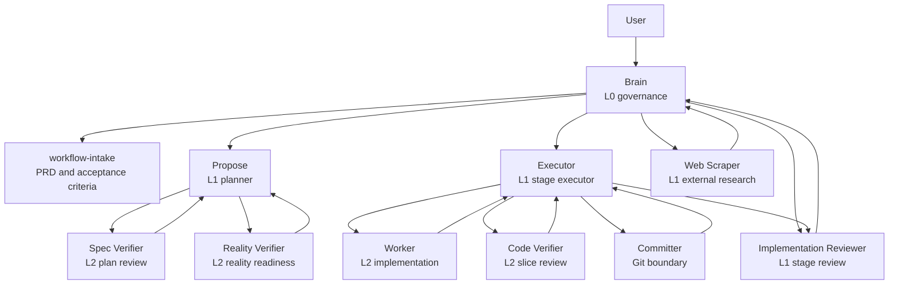

# ProofLoop

A proof-first multi-agent AI development workflow built on a customized OpenSpec.

ProofLoop prevents AI agents from producing valid-looking proposals, tasks, implementations, and archives that do not actually close the product loop.

It keeps OpenSpec as the artifact and schema substrate, then adds an explicit agent hierarchy, explicit verifier roles, and explicit workflow governance so AI cannot claim completion before it proves completion.

> Make AI prove completion before it claims completion.

## Why this exists

Stock OpenSpec is strong at change artifacts, but a harder delivery environment usually needs more than:

- proposal generation
- tasks checkboxes
- local tests
- archive sync

The common failure mode is not missing documents. It is a false closed loop:

- the paperwork looks complete
- the tasks look done
- the implementation drift is hidden in slices
- the main workflow guidance is underspecified, so subagents keep guessing

ProofLoop adds a Brain-governed execution layer to stop that drift.

## Install

Choose the fastest path for an existing project:

1. One-command local install with PowerShell:

```powershell
pwsh -File ./install/install-proofloop.ps1 -TargetProjectPath <path-to-target-project>
```

2. One-command GitHub bootstrap after the repo is published:

```powershell
pwsh -NoProfile -ExecutionPolicy Bypass -Command "& {
	$bootstrap = Join-Path $env:TEMP 'proofloop-bootstrap.ps1'
	Invoke-WebRequest 'https://raw.githubusercontent.com/LZHcode1986/ProofLoop/main/install/bootstrap-proofloop.ps1' -OutFile $bootstrap
	& $bootstrap -RepositoryZipUrl 'https://github.com/LZHcode1986/ProofLoop/archive/refs/heads/main.zip' -TargetProjectPath '<path-to-target-project>'
}"
```

3. AI-assisted install with the ready-made prompt in [install/agent-install-prompt.md](install/agent-install-prompt.md).
4. Manual fallback in [install/manual-install.md](install/manual-install.md).

The installer uses three destinations by default:

- project files such as `AGENTS.md` and `openspec/**` go into the target project
- agent definitions go into `$HOME/.opencode/agents`
- skills go into `$HOME/.agents/skills`

If your local runtime uses different user directories, the installer supports path overrides.

See [install/README.md](install/README.md) for the full install entry.

## Quick start

1. Keep this ProofLoop repository available locally.
2. Run the installer or paste the AI install prompt in the target project.
3. Fill any remaining placeholders in `openspec/config.yaml` if the installer created it from the example.
4. Run your normal OpenSpec validation command inside the target project.

## PRD to stage flow

Brain does not send the whole PRD to Propose in one pass.

The intended flow is:

1. `workflow-intake` turns the raw request into `PRD.md`.
2. Brain partitions the PRD into stages.
3. Each stage represents one independently valuable function or one coherent module boundary.
4. Brain dispatches exactly one stage to Propose.
5. Propose either decomposes that stage into OpenSpec artifacts and `tasks.md`, or returns `Stage repartition required`.

This protects task decomposition from drifting across unrelated modules and keeps later verification aligned with the stage acceptance criteria.

## Workflow



## Agent hierarchy

### L0

- Brain
	- Owns `PRD.md`, `CLARIFY.md`, `tech-spec.md`, and authoritative workflow guidance such as `AGENTS.md`, config, schemas, and gate documents.
	- Owns the top-level acceptance criteria.
	- Dispatches L1 agents.

### L1

- Propose
	- Converts one Brain-selected stage from a stable PRD into `proposal.md`, `design.md`, `specs/*`, and `tasks.md`.
	- Passes Brain-owned acceptance criteria to `spec-verifier` and the configured reality readiness verifier without changing them.

- Executor
	- Runs apply-stage orchestration.
	- Uses the prepared slice/gate standards from `tasks.md` for slice verification.

- Web Scraper
	- Gathers external facts, technical standards, upstream examples, and feasibility evidence for Brain or Propose.
	- Works best when Brain sends a narrow research packet instead of a vague "go search the web" request.
	- Does not hot-inject knowledge into Worker.

- Implementation Reviewer
	- Performs stage-level acceptance and archive-readiness review.
	- Does not replace slice-level or artifact-level verification.

### L2

- Spec Verifier
	- Reviews planning artifacts for readiness and acceptance coverage.

- Reality Verifier
	- Reviews planning artifacts against current repository reality before execution.
	- The default verifier uses repository files and commands; projects with CodeGraph can opt into the CodeGraph-backed variant.

- Worker
	- Implements exactly one task packet.

- Code Verifier
	- Reviews one implementation slice.

- Committer
	- Closes git boundaries and returns receipts for worker-output and archive-output boundaries.

## Acceptance criteria contract

Acceptance criteria start at Brain and remain immutable downstream.

1. Brain defines and owns the acceptance criteria in the PRD and dispatch packets.
2. Propose maps them to artifacts, slices, task packets, and verifier gates without rewriting or weakening them.
3. Spec Verifier validates planning artifacts against the caller-supplied criteria.
4. Reality Verifier checks whether critical runtime assumptions and the minimum closed loop match current repository reality.
5. Code Verifier validates only the assigned slice/gate criteria derived from the stage contract.
6. Executor consumes the prepared task and gate standards; it does not redefine acceptance scope during execution.
7. Implementation Reviewer performs stage-level judgment using the original criteria plus the accumulated verifier evidence.

## Config example

[openspec/config.yaml.example](openspec/config.yaml.example) is a reference template for new projects, not a Brain-maintained runtime file.

In a new project, the config should at minimum define:

- `schema`
- `context`
- `rules`

For this workflow, it is also useful to keep:

- authority order
- canonical objects
- state model
- testing posture
- optional `traceability` links to stable authority sources

To install the schema cleanly in another project, see [openspec/schemas/README.md](openspec/schemas/README.md).
To install the whole ProofLoop workflow, not just the reusable schema, see [install/README.md](install/README.md).

## Schema layout

The live reusable schema is stored in [openspec/schemas/spec-driven](openspec/schemas/spec-driven).
ProofLoop keeps the schema identity as `spec-driven` for compatibility with OpenSpec's default SDD workflow.

This repository now follows the normal OpenSpec schema layout:

- one schema per folder under `openspec/schemas/`
- one `schema.yaml` at the schema root
- one `templates/` folder for the artifact templates

The important invariant is simple: folder name, `schema.yaml` `name:`, and `openspec/config.yaml` `schema:` should match.

## Relationship to OpenSpec and opencode

- OpenSpec provides the artifact, schema, status, apply, and archive automation substrate.
- opencode provides the runtime model for primary agent, subagent, task dispatch, permissions, and tool execution.
- ProofLoop is the governance layer that binds them into a stricter closed loop.
- OpenSpec remains the source of truth for change artifacts, schemas, config, and archive flow.
- This repository still keeps OpenSpec-compatible installed skill names such as `openspec-propose` and `openspec-apply-change`.
- Archive is a two-phase transition: Implementation Reviewer recommends archive, Brain authorizes it, Implementation Reviewer executes `openspec-archive-change`, and Committer closes the archive git boundary.

## What Brain can update

If execution exposes a workflow defect rather than a product defect, Brain is allowed to tune the authoritative workflow documents instead of forcing more retries.

Typical write-back targets:

- `PRD.md`
- `CLARIFY.md`
- `tech-spec.md`
- `AGENTS.md`
- `openspec/config.yaml`
- `openspec/QUALITY-GATE.md`
- `openspec/schemas/**`
- gate documents such as `QUALITY-GATE.md`

## Git worktree flow

The current MVP uses git worktree as an execution-isolation policy, not as a fully automated manager feature.

1. Brain or the human operator chooses the active change and, when needed, a dedicated worktree for that change.
2. Propose works from the planning home and writes formal change artifacts under `openspec/changes/<change-id>/`.
3. Executor runs inside the selected worktree and assumes that worktree is already active.
4. Worker implements one task at a time in that worktree.
5. Committer closes a git boundary and returns a receipt after each completed Worker attempt.
6. Code Verifier validates slice gates in the same worktree.
7. Implementation Reviewer performs stage-level review before archive or next-stage promotion.
8. Archive output, if any, returns to Committer for boundary closure instead of being committed directly by Implementation Reviewer.

Current non-goals:

- no automatic worktree creation
- no automatic worktree cleanup
- no automatic rebase across multiple worktrees
- no parallel worktree manager yet

Those belong to a future `manager` role if the workflow grows beyond the current MVP.

## Repository map

- `agents/`
	- Agent definitions for Brain, Propose, Executor, Worker, verifiers, and git boundary roles.
	- `agents/contracts/dispatch-packets.md` defines fixed Brain-to-subagent packet formats.
- `openspec/`
	- OpenSpec-compatible schema, schema install guidance, config example, gate documents, and formal change artifacts.
- `install/`
	- One-command installer, AI install prompt, and manual fallback instructions.
- `skills/`
	- OpenSpec canonical skills plus Brain-layer orchestration skills.

## Start here

1. Read [install/README.md](install/README.md) if you want to install ProofLoop into another project quickly.
2. Read [skills/README.md](skills/README.md) to understand canonical OpenSpec skills versus orchestration-layer skills.
3. Read [agents/brain.md](agents/brain.md) for the top-level routing and governance contract.
4. Read [agents/propose.md](agents/propose.md) and [agents/executor.md](agents/executor.md) for the L1 planning and execution contracts.
5. Read [openspec/QUALITY-GATE.md](openspec/QUALITY-GATE.md) for the current gate model.
6. Read [openspec/schemas/README.md](openspec/schemas/README.md) if you want to install the reusable schema in another OpenSpec project.

## License

[MIT](LICENSE)
