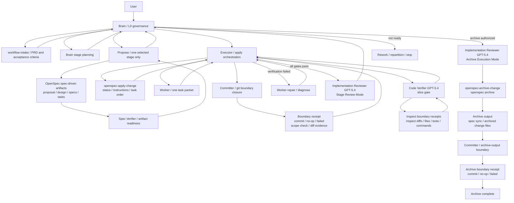

# ProofLoop 工作流整改报告

生成日期：2026-05-21  
评估对象：`LZHcode1986/ProofLoop` 当前公开仓库  
整改目标：在不新增 `git-boundary-verification` skill、不新增 `Archiver` agent 的前提下，收紧 ProofLoop 的职责边界、证据链、archive 授权流程、schema 命名一致性，并明确修改后的完整工作流。

---

## 1. 执行摘要

本轮整改不建议新增 agent 或新增 skill，而是对现有文档进行职责收紧：

1. **`Implementation Reviewer` 保留 archive 执行权**，但必须改为“两阶段协议”：  
   - 第一阶段只做 stage-level review，并把 `Archive recommendation` 给 Brain；
   - Brain 判断是否 archive；
   - 若 Brain 授权，仍由同一个 `Implementation Reviewer` 加载 `openspec-archive-change` skill 执行 archive；
   - archive 产生的 git 边界仍交给 `Committer` 关闭并生成 archive boundary receipt，`Implementation Reviewer` 不直接提交。

2. **不新增 `git-boundary-verification` skill**。  
   将 git boundary 的机械检查、commit/no-op/failure receipt、scope check、diff evidence 统一整合进现有 `committer.md`。  
   `Committer` 负责“证据包生成”，`Code Verifier` 负责“语义验证”。

3. **schema 命名统一为 `spec-driven`**。  
   当前仓库实际目录是 `openspec/schemas/spec-driven/`，且 OpenSpec 官方默认 schema 也是 `spec-driven`。  
   因此应统一 README、config example、schema README、安装脚本、安装文档和 AI 安装提示中的残留 `proofloop` 命名。

4. **把 `AGENTS.md` 中的详细 Stage Planning / Task Decomposition 规则迁移回对应 agent 文档**。  
   - `Stage Planning Rules` 归属 `agents/brain.md`
   - `Task Decomposition Rules` 归属 `agents/propose.md`
   - `AGENTS.md` 保留全局原则和 rule ownership index，不再承载细粒度工作流细则。

5. **Executor 的 dispatch packet 需要增强**。  
   - 给 `Committer` 增加 `Allowed File Scope / Expected Changed Paths / Forbidden Paths / Boundary Receipt Required`
   - 给 `Code Verifier` 增加 `Boundary Receipts / Boundary Diff Requirements`

6. **`Code Verifier` 需要强制读取 boundary receipt 和实际 diff**。  
   Worker summary 只能算 claim，不能算 evidence。  
   Verifier 必须把 commit receipt、diff、测试、命令输出作为 pass/fail 依据。

7. **canonical skills 也必须同步整改**。  
   `agents/*.md` 是角色契约，但 `openspec-propose`、`openspec-apply-change`、`openspec-archive-change` 是实际流程入口。  
   如果只改 agent 文档而不改 skill，执行时仍会回到旧流程。

---

## 2. 研究依据

本报告基于以下当前公开文件和官方仓库：

| 来源 | 作用 |
|---|---|
| `README.md` | ProofLoop 定位、workflow、agent hierarchy、OpenSpec/opencode 关系、worktree flow |
| `AGENTS.md` | 当前 Stage Planning / Task Decomposition / Verification / Git Worktree 全局规则 |
| `agents/brain.md` | Brain 权责、PRD/stage ownership、archive 不由 Brain 直接执行 |
| `agents/propose.md` | Propose 的 one-stage planning、stage validation、tasks 生成约束 |
| `agents/executor.md` | apply orchestration、Worker dispatch、git boundary protocol、Code Verifier dispatch |
| `agents/committer.md` | 当前 commit boundary agent，职责较少，适合承接 boundary evidence receipt |
| `agents/code-verifier.md` | slice-level verification、required skills evidence、checkbox owner |
| `agents/implementation-reviewer.md` | stage-level review、当前 archive 自动执行逻辑 |
| `skills/openspec-propose/SKILL.md` | 当前任务生成规则入口，需要补 boundary 字段要求 |
| `skills/openspec-apply-change/SKILL.md` | 当前 apply canonical skill，需要补 boundary receipt 和 verifier diff evidence 流程 |
| `skills/openspec-archive-change/SKILL.md` | archive skill 的实际复杂度较低，主要封装 `openspec archive` |
| `openspec/config.yaml.example` | 当前仍写 `schema: proofloop` |
| `openspec/schemas/README.md` | 当前仍描述 `openspec/schemas/proofloop/` |
| `openspec/schemas/spec-driven/schema.yaml` | 当前实际 schema name 是 `spec-driven` |
| `install/install-proofloop.ps1` | 当前仍复制不存在的 `openspec/schemas/proofloop` 并写入 `schema: proofloop` |
| `install/README.md`、`install/manual-install.md`、`install/agent-install-prompt.md` | 当前安装验证仍指向 `proofloop` schema |
| OpenSpec 官方 `schemas/spec-driven/schema.yaml` | 官方默认 schema 名称也是 `spec-driven` |

---

## 3. 总体整改原则

### 3.1 不新增复杂角色

本次整改不新增：

- `Archiver` agent
- `git-boundary-verification` skill
- 自动 worktree manager
- parallel execution manager
- dashboard / metrics system

当前阶段先优化 **workflow correctness**，不提前做自动化扩展。

### 3.2 证据链优先

每个 Worker attempt 结束后必须形成明确边界：

```text
Worker output
  ↓
Committer closes git boundary
  ↓
Executor records boundary receipt
  ↓
Code Verifier consumes receipt and inspects diff
```

没有 boundary receipt 的 Worker output 不应进入 slice verification。

### 3.3 决策权和执行权分离，但不必拆 agent

archive 不必新增 agent，但必须分离“判断”和“执行”：

```text
Implementation Reviewer Phase A = 判断 archive readiness
Brain = 决策是否 archive
Implementation Reviewer Phase B = 执行 archive skill
Committer = 关闭 archive-output git boundary 并生成 receipt
```

`Implementation Reviewer` 执行 archive 时可以让 OpenSpec CLI 修改 specs / archive 目录，但不应直接 `git add` / `git commit`。  
所有 archive 后的 git 变更仍进入 `Committer`，这样 proof loop 的证据链不会在最后一步断开。

### 3.4 OpenSpec 是底座，不是要摆脱的对象

建议在 README 中明确：

```text
OpenSpec = artifact / schema / CLI automation substrate
ProofLoop = governance / verification / proof-first orchestration layer
opencode = runtime / permission / subagent dispatch layer
```

---

## 4. 需要整改的文档和具体修改内容

---

# 4.1 `README.md`

## 当前问题

当前 README 已经正确表达了 ProofLoop 的核心价值：  
“Make AI prove completion before it claims completion.”

但仍有三处需要整改：

1. Schema layout 仍写 `openspec/schemas/proofloop`，与实际目录 `openspec/schemas/spec-driven` 不一致。
2. Workflow 图中没有表达 Brain 授权 archive 后由 Implementation Reviewer 执行 archive 的两阶段模式。
3. Committer 仍被描述为 “Closes git boundaries only”，没有体现 boundary receipt / scope check / diff evidence。

## 建议修改

### 4.1.1 修改 Schema layout

**修改前：**

```md
The live reusable schema is stored in [openspec/schemas/proofloop](openspec/schemas/proofloop).
```

**修改后：**

```md
The live reusable schema customizes OpenSpec's standard `spec-driven` schema and is stored in [openspec/schemas/spec-driven](openspec/schemas/spec-driven).

ProofLoop keeps the schema identity as `spec-driven` for compatibility with OpenSpec's default SDD workflow. ProofLoop adds governance, verifier gates, boundary receipts, and archive authorization on top of that schema instead of renaming the schema package.
```

### 4.1.2 修改 Relationship to OpenSpec and opencode

建议增加：

```md
## Layer model

- OpenSpec provides the artifact, schema, status, apply, and archive automation substrate.
- opencode provides the runtime for primary agents, subagents, permissions, and task dispatch.
- DeepSeek V4 is the main planning and execution model layer.
- GPT-5.4 verifier/reviewer agents provide independent judgment.
- ProofLoop is the governance layer that binds them into a stricter proof-first closed loop.
```

### 4.1.3 修改 workflow 描述

建议在 workflow 或紧随其后增加：

```md
Archive is a two-phase transition:

1. `Implementation Reviewer` performs stage-level review and returns `Archive recommendation`.
2. `Brain` decides whether archive is authorized.
3. If Brain authorizes archive, the same `Implementation Reviewer` runs `openspec-archive-change`.
4. If archive changes files, `Committer` closes the `archive-output` git boundary and returns a boundary receipt.

Reviewer may execute archive only after explicit Brain authorization.
Reviewer must not commit archive output directly.
```

### 4.1.4 修改 Committer 说明

**修改前：**

```md
- Committer
  - Closes git boundaries only.
```

**修改后：**

```md
- Committer
  - Closes git boundaries.
  - Performs mechanical file-scope checks.
  - Creates commit / no-op / failure boundary receipts.
  - Provides diff evidence for Code Verifier.
```

---

# 4.2 `AGENTS.md`

## 当前问题

`AGENTS.md` 当前承载了较多具体流程规则：

- Stage Planning Rules
- Task Decomposition Rules
- Verification Boundaries
- Git Worktree Policy
- Think Before Coding
- Simplicity First
- Surgical Changes

其中 `Stage Planning Rules` 更适合归属 `brain.md`，`Task Decomposition Rules` 更适合归属 `propose.md`。  
`AGENTS.md` 应保留全局约束、优先级、repo-specific operating rules，以及 rule ownership index。

整改后应明确三层权威边界：

- `openspec/` 仍是 artifact、schema、gate 和 CLI workflow 的单一事实来源。
- `agents/*.md` 是角色职责、dispatch packet、权限边界和 subagent 协作契约。
- `AGENTS.md` 是仓库级 operating rules 和 rule ownership index，不再承载 Brain / Propose 的内部细则。

## 建议修改

### 4.2.1 保留 Rule Priority 和 Repo Role

保留现有：

```md
## Rule Priority
## Repo Role
## Source Of Truth
```

### 4.2.2 增加 Rule Ownership Index

建议新增：

```md
## Workflow Rule Ownership

- Brain owns PRD intake, acceptance criteria, stage planning, and archive transition decisions. See `agents/brain.md`.
- Propose owns one-stage OpenSpec decomposition into proposal, design, specs, and tasks. See `agents/propose.md`.
- Executor owns apply orchestration, Worker dispatch, run ledger, git boundary dispatch, verifier dispatch, and rescue flow. See `agents/executor.md`.
- Worker owns one implementation task only.
- Committer owns git boundary closure, mechanical scope checks, and boundary receipts. See `agents/committer.md`.
- Code Verifier owns slice-level semantic verification after boundary receipts exist. See `agents/code-verifier.md`.
- Implementation Reviewer owns stage-level integrated review and Brain-authorized archive execution. See `agents/implementation-reviewer.md`.
- Committer owns archive-output boundary closure after archive execution. See `agents/committer.md`.
```

### 4.2.3 精简 Stage Planning Rules

`AGENTS.md` 中只保留摘要：

```md
## Stage Planning Summary

Brain must partition PRD work into stages before Propose runs.
Detailed stage planning rules live in `agents/brain.md`.
```

详细规则迁移至 `brain.md`。

### 4.2.4 精简 Task Decomposition Rules

`AGENTS.md` 中只保留摘要：

```md
## Task Decomposition Summary

Propose must turn exactly one Brain-selected stage into OpenSpec artifacts and verifier-gated `tasks.md`.
Detailed task decomposition rules live in `agents/propose.md`.
```

详细规则迁移至 `propose.md`。

---

# 4.3 `agents/brain.md`

## 当前问题

`brain.md` 已经拥有 stage decomposition 权限，并明确 Brain 不执行 archive。  
但需要增强三点：

1. 把 Stage Planning Rules 从 `AGENTS.md` 正式迁移进来。
2. 明确 Brain 是 archive transition decision owner。
3. 明确 Brain 可以把 archive execution 授权回同一个 `Implementation Reviewer`。

## 建议修改

### 4.3.1 在 Responsibilities 中增加

```md
12. Own archive transition decisions after `@implementation-reviewer` returns a stage-level archive recommendation.
13. Dispatch `@implementation-reviewer` in Archive Execution Mode only after Brain explicitly authorizes archive.
```

### 4.3.2 修改 Ownership Boundaries

**当前：**

```md
Brain does not own:
- archive execution
```

**建议改为：**

```md
Brain does not own:
- archive execution

Brain owns:
- archive transition decision after stage-level review
```

### 4.3.3 增加 Stage Planning Rules

建议新增完整小节：

```md
## Stage Planning Rules

Brain owns PRD decomposition into stages.

Before dispatching Propose, Brain must define:

- Stage objective
- Stage boundary
- Explicit out-of-scope
- Immutable acceptance criteria
- Major risks
- Authority source
- Real user or system entry path
- Minimum closed loop

A valid stage must represent exactly one of:

1. One independently valuable capability, or
2. One coherent module boundary.

Brain must reject or repartition a stage when:

- It mixes unrelated capabilities.
- It crosses unrelated module boundaries.
- It creates obvious change amplification without a clear module or delivery benefit.
- It has vague ownership or vague acceptance criteria.
- It depends on hidden sequencing across unrelated modules.

If two partitions are plausible, Brain must compare both before choosing.
```

### 4.3.4 增加 Archive Authorization Protocol

```md
## Archive Authorization Protocol

Brain owns the decision to archive after stage-level review.

Flow:

1. Dispatch `@implementation-reviewer` in Stage Review Mode.
2. Read the review result and `Archive recommendation`.
3. Decide one of:
   - archive
   - rework
   - repartition
   - stop / report blocker
4. If archive is authorized, dispatch the same `@implementation-reviewer` in Archive Execution Mode.
5. After archive execution, if git changes exist, dispatch `@committer` to close an `archive-output` boundary.

Brain must not run `openspec archive` directly.
Brain must not treat `Archive recommendation: ready` as automatic authorization.
Brain must not let Implementation Reviewer commit archive output directly.
```

---

# 4.4 `agents/propose.md`

## 当前问题

`propose.md` 已经正确规定了 one-stage planning 和 stage validation，但 Task Decomposition Rules 仍主要在 `AGENTS.md` 和 schema template 中。  
建议把任务拆分契约写进 `propose.md`，让 Propose 本身成为规则权威。

## 建议修改

### 4.4.1 增加 Task Decomposition Rules

```md
## Task Decomposition Rules

Propose receives exactly one Brain-selected stage.

Before writing tasks, Propose must verify:

- The stage objective is clear.
- The stage boundary is stable.
- The out-of-scope list prevents scope creep.
- The acceptance criteria are immutable and testable.
- The minimum closed loop is explicit.
- The target artifacts still describe one stage, not a whole PRD.

Propose must decompose the stage into:

- Setup
- Blocking / proof tasks when needed
- Slice 1..N
- Explicit verifier gate after each implementation slice
- Reconciliation

Each implementation slice must include:

- Slice goal
- Independent acceptance criteria
- Covered tasks
- File scope
- Verification command
- Required skills
- Required review skills
- Explicit PASS/FAIL gate
```

### 4.4.2 增加 boundary 字段要求

在 Planning Constraints 或 Task Decomposition Rules 中补充：

```md
Every implementation task must provide enough information for Executor to dispatch a boundary-aware Worker and Committer:

- Execution Type
- Required Skills
- Required Review Skills, when applicable
- Allowed File Scope
- Verification Command
- Boundary Receipt Required: yes | no-op allowed
```

### 4.4.3 增加对 Code Verifier 的任务格式要求

```md
Every verifier task must include:

- Covered Tasks
- Inspection Scope
- Inspection Content
- Out of Scope
- PASS/FAIL Gate
- Required Review Skills
- Boundary Evidence Required: yes
```

---

# 4.5 `agents/executor.md`

## 当前问题

`executor.md` 已经有较完整的 git boundary protocol。  
但仍需增强两个 dispatch packet：

1. 给 `Committer` 的 packet 要传入 file scope 和 expected paths。
2. 给 `Code Verifier` 的 packet 要传入 boundary receipts 和 diff requirements。

## 建议修改

### 4.5.1 修改 Committer Dispatch 结构

**当前结构：**

```text
Executor Dispatch: Git Boundary
Boundary Type: run-checkpoint | worker-output
Change:
Task ID:
Attempt:
Reason:
Expected Action:
```

**建议改为：**

```text
Executor Dispatch: Git Boundary
Boundary Type: run-checkpoint | worker-output
Change:
Task ID:
Attempt: initial | repair-1 | repair-2 | diagnose | none
Reason:
Allowed File Scope:
Expected Changed Paths:
Forbidden Paths:
Boundary Receipt Required:
- commit hash or no-op receipt
- branch
- pre-commit HEAD
- parent hash
- files staged
- files outside allowed scope
- scope check
- diff evidence availability
Expected Action:
- Inspect git status.
- Inspect changed file list.
- Verify changed files are inside Allowed File Scope.
- Stage only changes relevant to this boundary.
- Commit if relevant changes exist.
- Return the required first line and boundary receipt.
```

### 4.5.2 修改 Code Verification Dispatch

**当前 Code Verification Dispatch 缺少 boundary receipts。**

建议增加：

```text
Boundary Receipts:
- Task <id> <attempt>:
  - Receipt status: commit | no-op | failed
  - Commit hash:
  - Files staged:
  - Scope check:
  - Files outside allowed scope:
  - Diff evidence:

Boundary Diff Requirements:
- Inspect every covered commit or no-op receipt.
- Verify file scope, task scope, checkbox consistency, and required skill evidence.
- Treat missing boundary evidence as Verification failed.
```

### 4.5.3 修改 ledger 字段

**当前：**

```text
task_boundary[Task ID][attempt]: clean | commit:<hash> | failed
```

**建议：**

```text
task_boundary[Task ID][attempt]:
  status: clean | commit | failed
  receipt: <boundary receipt summary>
  commit_hash: <hash | none>
  files_staged: [...]
  scope_check: passed | failed
```

### 4.5.4 强化 verifier 前置条件

```md
Before dispatching `@code-verifier`, Executor must confirm every covered Worker attempt has a boundary receipt.

A boundary receipt may be:

- commit receipt
- explicit no-op receipt
- failed receipt, which blocks execution

If any covered task lacks a boundary receipt, do not dispatch Code Verifier; stop with `Execution blocked`.
```

---

# 4.6 `agents/committer.md`

## 当前问题

当前 `committer.md` 职责较少，只负责：

- inspect git status
- stage relevant changes
- commit
- return commit hash / staged files count / message / no-op / failure

这正好适合升级为 Git Boundary Committer，而不新增 skill。

## 建议修改方向

将 `Committer` 从：

```text
Git staging and commit boundary subagent
```

升级为：

```text
Git boundary closure and evidence receipt subagent
```

## 具体修改内容

### 4.6.1 修改 description

**修改前：**

```yaml
description: Git staging and commit boundary subagent.
```

**修改后：**

```yaml
description: Git boundary closure and evidence receipt subagent.
```

### 4.6.2 增加权限

当前允许 `git status*`、`git diff*`、`git add *`、`git commit*`、`git rev-parse*`、`git branch --show-current`。  
建议新增：

```yaml
"git show*": allow
```

原因：Committer 需要在 commit 后确认 diff evidence 可用。

### 4.6.3 修改职责描述

**建议替换为：**

```md
You are a **Committer Agent**.

Your responsibility is to close a git boundary requested by Executor and return a verifiable boundary receipt.

You do not judge task completion or implementation correctness.
You only verify git boundary integrity mechanically.
```

### 4.6.4 增加 Boundary Scope Check

```md
## Boundary Scope Check

For `worker-output` boundaries:

- Read `Allowed File Scope` from the caller.
- Inspect changed files before staging.
- If any dirty file is outside `Allowed File Scope`, return `Commit failed`.
- Do not silently ignore out-of-scope dirty files.
- Do not stage unrelated cleanup, speculative refactors, generated noise, dependency churn, or public contract changes unless explicitly included in the boundary instruction.

For `run-checkpoint` boundaries:

- Preserve the pre-existing dirty worktree state only when Executor explicitly requests a run checkpoint.
- Return a receipt that clearly labels the commit as `run-checkpoint`.
```

### 4.6.5 增加 No-op Receipt

```md
## No-op Receipt

If there are no relevant changes for the requested boundary, return `No changes to commit`.

The receipt must still include:

- Boundary Type
- Change
- Task ID
- Attempt
- Branch
- Pre-commit HEAD
- No-op: yes
- No-op reason
```

### 4.6.6 增加输出格式

**修改前：**

```text
Commit created | No changes to commit | Commit failed
Commit hash:
Staged files count:
Commit message:
No-op:
Failure reason:
Files staged:
```

**修改后：**

```text
Commit created | No changes to commit | Commit failed

Boundary:
- Type:
- Change:
- Task ID:
- Attempt:
- Branch:
- Pre-commit HEAD:
- Commit hash:
- Parent hash:
- Commit message:

Scope:
- Allowed File Scope:
- Files staged:
- Files outside allowed scope:
- Scope check: passed | failed | not-applicable

Diff Evidence:
- Status inspected: yes | no
- Name-only diff inspected: yes | no
- Diff stat inspected: yes | no
- Commit stat available: yes | no | n/a
- Commit name-only available: yes | no | n/a

No-op:
- No-op: yes | no
- No-op reason:

Failure:
- Failure reason:
```

### 4.6.7 Committer 不应承担的职责

明确保留：

```md
You must not:

- modify files
- decide task completion
- interpret OpenSpec semantics beyond the caller's boundary instruction
- update `tasks.md`
- run tests as a quality judgment
- perform code review
- create or switch branches
- push, pull, merge, rebase, or resolve conflicts
- invoke subagents
- ask user questions
```

---

# 4.7 `agents/code-verifier.md`

## 当前问题

`code-verifier.md` 已经规定：

- 不信 Worker summary
- 检查文件、测试、命令证据
- 检查 Required Skills
- 检查 checkbox consistency
- 只更新 verifier gate checkbox

但缺少强制消费 `Boundary Receipts` 的规则。

## 建议修改

### 4.7.1 在 Scope 输入字段中增加

```md
The Executor should provide:

- Boundary Receipts
- Boundary Diff Requirements
```

### 4.7.2 增加 Boundary Receipt Requirement

```md
## Boundary Receipt Requirement

Before returning `Verification passed`, inspect the boundary receipt for every covered Worker attempt.

Worker summaries are claims.
Boundary receipts, diffs, tests, and command outputs are evidence.

Fail the gate when:

- any covered Worker attempt lacks a boundary receipt
- the receipt reports `Commit failed`
- the receipt reports files outside allowed scope
- the commit hash is missing for a non-no-op attempt
- the diff evidence is unavailable or inconsistent with Worker claims
- checkbox updates do not match implementation evidence
```

### 4.7.3 增加 Diff Inspection Rule

```md
## Diff Inspection Rule

For every covered commit receipt, inspect the actual diff before passing the gate.

Acceptable inspection commands include:

- `git show --stat <commit>`
- `git show --name-only <commit>`
- `git show <commit> -- <relevant-files>`
- `git diff <base>..<head> -- <inspection-scope>`

Do not pass a slice gate based only on final file state, Worker summary, or task checkbox state.
```

### 4.7.4 修改输出格式

Pass 输出增加：

```text
Boundary integrity:
- Boundary receipts inspected:
- Diff evidence inspected:
- Scope violations:
```

Fail 输出增加：

```text
Boundary integrity:
- Missing receipts:
- Failed receipts:
- Scope violations:
- Diff evidence gaps:
```

---

# 4.8 `agents/implementation-reviewer.md`

## 当前问题

当前 `implementation-reviewer.md` 中写明：  
当输出 `Archive recommendation: ready` 时，必须立即执行 archive。

这与“Brain 决定是否 archive”的治理模式不一致。  
但不需要新增 Archiver agent，只需把 Implementation Reviewer 改成两阶段模式。

## 建议修改

### 4.8.1 修改职责

增加：

```md
Implementation Reviewer has two modes:

1. Stage Review Mode
2. Archive Execution Mode
```

### 4.8.2 替换 Archive Execution 小节

**修改前核心含义：**

```md
When `Archive recommendation: ready` in the output, you MUST execute the archive immediately after returning the review result.
```

**修改后：**

```md
## Archive Authorization Protocol

Implementation Reviewer has two modes.

### Stage Review Mode

In Stage Review Mode, you review the stage outcome and return:

- `Archive recommendation: ready`
- `Archive recommendation: not-ready`
- `Archive recommendation: not-applicable`

You must not execute archive in Stage Review Mode.

When `Archive recommendation: ready`, return the review result to Brain.
Brain owns the archive transition decision.

### Archive Execution Mode

Only when Brain dispatches `Archive Authorized` may you load `openspec-archive-change` and execute the official archive workflow.

In Archive Execution Mode:

1. Load `openspec-archive-change`.
2. Run the official OpenSpec archive flow.
3. Report `Archive complete` or `Archive failed`.
4. If archive leaves git changes, report the dirty paths and `Archive boundary required: yes`.
5. Do not stage or commit archive output yourself; Brain must dispatch `Committer` for the archive-output boundary.

You must not decide archive readiness in Archive Execution Mode; that decision was already made by Brain.
```

Archive Execution Mode must be non-interactive. Brain must provide the exact change name and explicit archive authorization. If the archive skill detects ambiguity, incomplete tasks, or a validation warning that would normally require user confirmation, return `Archive failed` or `Archive blocked` to Brain instead of asking the user directly.

### 4.8.3 修改 Hard Constraints

当前写：

```md
You must not:
- update files
```

但 archive execution 会修改 specs / archive directory。  
建议改成：

```md
You must not:

- implement fixes
- update product code
- update task checkboxes
- re-run planning or apply workflows yourself
- ask the user questions directly
- execute archive unless Brain explicitly dispatches Archive Execution Mode
- stage or commit archive output directly
```

### 4.8.4 修改输出格式

Stage Review Mode 输出：

```text
Stage review passed | Stage review failed
Mode: Stage Review
Change:
Stage:
Acceptance criteria coverage:
Verifier evidence:
Archive recommendation: ready | not-ready | not-applicable
Findings:
Next action:
Brain authorization required before archive: yes
```

Archive Execution Mode 输出：

```text
Archive complete | Archive failed
Mode: Archive Execution
Change:
Brain authorization:
Command:
Archive path:
Warnings:
Archive boundary required: yes | no
Dirty paths after archive:
Commit result: handled by Committer | not-applicable
Failure reason:
```

---

# 4.9 `openspec/config.yaml.example`

## 当前问题

当前仍写：

```yaml
schema: proofloop
```

但当前实际 schema 文件夹是 `openspec/schemas/spec-driven/`，schema 文件中也是 `name: spec-driven`。

## 建议修改

**修改前：**

```yaml
schema: proofloop
```

**修改后：**

```yaml
schema: spec-driven
```

建议注释增加：

```yaml
# ProofLoop customizes OpenSpec's standard spec-driven schema instead of renaming it.
# Keep `schema: spec-driven` unless you intentionally fork the schema identity.
```

---

# 4.10 `openspec/schemas/README.md`

## 当前问题

当前 README 仍描述：

```text
openspec/schemas/proofloop/
schema: proofloop
```

但实际目录是 `spec-driven`。

## 建议修改

### 4.10.1 修改 layout

**修改前：**

```text
openspec/schemas/
├── README.md
└── proofloop/
```

**修改后：**

```text
openspec/schemas/
├── README.md
└── spec-driven/
    ├── schema.yaml
    └── templates/
```

### 4.10.2 修改安装说明

**修改前：**

```md
Copy `openspec/schemas/proofloop/` into the target project's `openspec/schemas/proofloop/`.
Keep `schema: proofloop`.
```

**修改后：**

```md
Copy `openspec/schemas/spec-driven/` into the target project's `openspec/schemas/spec-driven/`.
Keep `schema: spec-driven`.
```

### 4.10.3 修改命名说明

建议改成：

```md
ProofLoop keeps OpenSpec's standard `spec-driven` schema identity.

This makes the schema portable across projects that already understand OpenSpec's SDD workflow. ProofLoop adds stricter templates, verifier gates, and governance rules without renaming the schema package.
```

---

# 4.11 `openspec/schemas/spec-driven/templates/tasks.md`

## 当前问题

当前 tasks 模板已经很好地包含：

- Stage Acceptance Coverage Map
- Slice Goal
- Independent Acceptance Criteria
- Verifier sub-agent checks
- Inspection Scope
- Inspection Content
- Out of Scope
- PASS/FAIL Gate
- Readiness Gate

但还缺少三类运行时所需字段：

1. Execution Type
2. Required Skills / Required Review Skills
3. Boundary Receipt Required / Allowed File Scope 标准化表达

## 建议修改

### 4.11.1 在每个 implementation task 模板中增加字段

例如从：

```md
- [ ] 3.1 [Slice-1]
  - **Files:**
  - **Verification:**
```

改为：

```md
- [ ] 3.1 [Slice-1]
  - **Execution Type:** test-first-code | proof | docs-sync | setup | reconciliation
  - **Required Skills:** test-driven-development | diagnose | none
  - **Files / Allowed File Scope:**
  - **Verification:**
  - **Boundary Receipt Required:** yes | no-op allowed
```

### 4.11.2 在 verifier task 中增加字段

```md
- [ ] 3.3 [Slice-1]
  - **Execution Type:** verifier-gate
  - **Required Review Skills:** code-review-and-quality | security-and-hardening | performance-review
  - **Verification:** independent `verifier` sub-agent check
  - **Covered Tasks:** <3.1, 3.2>
  - **Boundary Evidence Required:** yes
  - **Inspection Scope:**
  - **Inspection Content:**
  - **Out of Scope:**
  - **PASS/FAIL Gate:**
```

### 4.11.3 Readiness Gate 增加

```md
- [ ] Every code-changing task declares `Execution Type: test-first-code`
- [ ] Every code-changing task declares `Required Skills: test-driven-development`
- [ ] Every implementation task declares `Boundary Receipt Required`
- [ ] Every verifier task declares `Boundary Evidence Required`
- [ ] Every verifier task declares `Required Review Skills`
```

---

# 4.12 `openspec/QUALITY-GATE.md`

## 当前问题

当前 Implementation Done Check 已包含：

- executable task checkboxes complete
- verification commands run
- verifier gates passed
- stage-review package prepared

但没有要求 boundary receipt。

## 建议修改

### 4.12.1 Tasks Readiness Check 增加

```md
- [ ] Does every implementation task declare an allowed file scope?
- [ ] Does every implementation task declare whether a boundary receipt is required?
- [ ] Does every verifier task require boundary evidence?
```

### 4.12.2 Implementation Done Check 增加

```md
- [ ] Does every completed Worker attempt have a commit/no-op boundary receipt?
- [ ] Did every slice verifier inspect the relevant boundary receipts and diffs?
- [ ] Are boundary scope checks clean for all covered Worker attempts?
```

---

# 4.13 `install/*`

## 当前问题

命名整改不能只改 README 和 schema 文档。当前安装链路仍然写死旧 schema：

- `install/install-proofloop.ps1` 复制 `openspec/schemas/proofloop`
- `Set-ProofLoopSchema` 会把目标项目 `openspec/config.yaml` 改成 `schema: proofloop`
- `install/README.md`
- `install/manual-install.md`
- `install/agent-install-prompt.md`

但当前仓库实际不存在 `openspec/schemas/proofloop/`，只有 `openspec/schemas/spec-driven/`。  
如果不改安装链路，安装器会继续生成错误目标状态，甚至在复制 schema 目录时失败。

## 建议修改

### 4.13.1 修改 installer 复制目录

**修改前：**

```powershell
$projectDirectoryAssets = @(
    'openspec/schemas/proofloop'
)
```

**修改后：**

```powershell
$projectDirectoryAssets = @(
    'openspec/schemas/spec-driven'
)
```

### 4.13.2 修改 config 设置函数

建议将 `Set-ProofLoopSchema` 改名为 `Set-ProofLoopOpenSpecSchema` 或保留函数名但把内部 schema 值全部改成 `spec-driven`：

```powershell
schema: spec-driven
```

所有日志也同步从：

```text
schema: proofloop
```

改为：

```text
schema: spec-driven
```

### 4.13.3 修改安装文档和 AI 安装提示

以下路径和验证点全部改为 `spec-driven`：

```text
openspec/schemas/spec-driven/
openspec/schemas/spec-driven/schema.yaml
schema: spec-driven
```

覆盖文件：

- `install/README.md`
- `install/manual-install.md`
- `install/agent-install-prompt.md`

---

# 4.14 `skills/openspec-apply-change/SKILL.md`

## 当前问题

`agents/executor.md` 明确声明 `openspec-apply-change` 决定 WHAT 和 ORDER，是 canonical apply workflow。  
如果只在 `executor.md` 中加入 boundary receipt，而 `openspec-apply-change` 仍只描述 Worker -> Code Verifier，执行入口会继续缺少证据链。

## 建议修改

### 4.14.1 在 apply workflow 中加入 boundary closure

在 Worker 返回 `Implementation finished` 后、任何下一任务或 Code Verifier 前，增加：

```md
- Dispatch `@committer` to close the Worker-output git boundary.
- Record a commit / no-op / failed boundary receipt.
- Do not dispatch `@code-verifier` until every covered Worker attempt has a boundary receipt.
```

### 4.14.2 修改 Code Verifier dispatch 要求

将当前 “covered Worker evidence” 扩展为：

```md
Code Verifier dispatch must include:

- covered Worker summaries
- boundary receipts for every covered Worker attempt
- changed files in slice
- diff evidence requirements
- required skills evidence
- verification command output
```

### 4.14.3 修改 Implementation Done Check 描述

增加：

```md
Implementation Done Check must confirm:

- every completed Worker attempt has a commit/no-op boundary receipt
- every slice verifier inspected the relevant receipts and diffs
- archive is not suggested until boundary evidence is complete
```

---

# 4.15 `skills/openspec-propose/SKILL.md`

## 当前问题

`openspec-propose` 当前已经要求：

- `Execution Type`
- `Required Skills`
- `Required Review Skills`
- `Skill Reason`

但还没有把 `Boundary Receipt Required` 和 verifier 的 `Boundary Evidence Required` 写成任务生成标准。  
这会导致 `tasks.md` 模板、Propose agent、Executor packet、Code Verifier packet 四处契约不完全一致。

## 建议修改

### 4.15.1 修改 task decomposition requirements

增加：

```md
- Every implementation task must include `Boundary Receipt Required: yes | no-op allowed`.
- Every verifier-gate task must include `Boundary Evidence Required: yes`.
- Every implementation task must provide `Allowed File Scope` precise enough for Committer scope checks.
- Every verifier-gate task must state that missing boundary receipts or unavailable diff evidence fail the gate.
```

### 4.15.2 修改 Tasks Readiness Check

增加：

```md
The `spec-verifier` must fail Tasks Readiness Check when:

- any implementation task lacks Allowed File Scope
- any implementation task lacks Boundary Receipt Required
- any verifier task lacks Boundary Evidence Required
- verifier gates do not require receipt and diff inspection
```

---

# 4.16 `skills/openspec-archive-change/SKILL.md`

## 当前问题

当前 archive skill 面向用户直接使用时可以询问用户：

- 多个 active changes 时询问要 archive 哪个
- artifacts 或 tasks 不完整时询问是否继续

但在 ProofLoop 两阶段协议中，Archive Execution Mode 是由 Brain 授权的 subagent 执行。  
`Implementation Reviewer` 不应直接向用户提问，也不应把“推荐 ready”当作继续 archive 的自动授权。

## 建议修改

### 4.16.1 增加 Brain-authorized non-interactive mode

```md
## Brain-Authorized Non-Interactive Mode

When called by `Implementation Reviewer` in Archive Execution Mode:

- require an explicit change name
- require explicit Brain authorization
- do not ask the user questions
- do not infer a different change
- if multiple changes, incomplete tasks, or validation warnings create ambiguity, return `Archive blocked`
- run only the official `openspec archive` command when the authorization packet is sufficient
```

### 4.16.2 修改输出

增加：

```text
Archive complete | Archive failed | Archive blocked

Change:
Brain authorization:
Command:
Archive path:
Warnings:
Dirty paths after archive:
Archive boundary required: yes | no
Failure/blocker reason:
```

### 4.16.3 明确不提交

增加：

```md
This skill must not stage or commit archive output when running under ProofLoop Archive Execution Mode.
The caller must route archive git changes through `Committer` so the workflow receives an archive boundary receipt.
```

---

## 5. 修改后的完整工作流程



---

## 6. 修改前后对比

| 维度 | 修改前 | 修改后 |
|---|---|---|
| Schema 命名 | README/config/安装链路中写 `proofloop`，实际目录和 schema 是 `spec-driven` | README、config、schema README、installer、安装文档全部统一为 `spec-driven` |
| OpenSpec 定位 | OpenSpec 是 artifact/schema substrate，但 schema 命名表达混乱 | OpenSpec 是 `spec-driven` artifact/schema/CLI 自动化底座，ProofLoop 是治理层 |
| Stage Planning Rules | 细则在 `AGENTS.md` | 细则迁移到 `brain.md`，`AGENTS.md` 只保留 ownership index |
| Task Decomposition Rules | 细则在 `AGENTS.md` + schema 模板 | 细则迁移到 `propose.md`，schema 模板只承载 artifact 格式 |
| Brain 的 archive 职责 | Brain 不执行 archive，但是否拥有授权权不够明确 | Brain 明确拥有 archive transition decision |
| Implementation Reviewer archive | `Archive recommendation: ready` 后立即执行 archive，并可能直接提交 archive 输出 | Phase A 只审查；Brain 授权后 Phase B 执行 archive；archive git 输出由 Committer 关闭边界 |
| 是否新增 Archiver | 可选讨论 | 不新增，保持轻量 |
| Committer 职责 | 只 stage/commit，返回简单 hash | 关闭 git boundary、做机械 scope check、生成 boundary receipt |
| 是否新增 git-boundary skill | 曾考虑新增 | 不新增，整合入 `committer.md` |
| Executor -> Committer packet | 缺少 explicit allowed scope / expected paths | 增加 Allowed File Scope、Expected Changed Paths、Forbidden Paths、Receipt Required |
| Executor -> Code Verifier packet | 缺少 boundary receipt | 增加 Boundary Receipts 和 Boundary Diff Requirements |
| Code Verifier 证据源 | 文件/测试/命令/Worker summary | boundary receipt + diff + 文件 + 测试 + 命令；Worker summary 只算 claim |
| canonical skills | agent 文档和 skills 流程入口存在漂移 | `openspec-propose`、`openspec-apply-change`、`openspec-archive-change` 同步 boundary / archive 协议 |
| 每任务 commit | 已有 Worker-output boundary commit 思想 | 升级为正式 boundary commit protocol |
| archive commit | Implementation Reviewer 可能直接 `git add` / `git commit` | archive 后由 Committer 生成 archive boundary receipt |
| no-op 情况 | 简单返回 no changes | 生成 no-op boundary receipt |
| out-of-scope dirty files | Committer 可能只 stage relevant changes | worker-output boundary 中发现 out-of-scope dirty files 直接 `Commit failed` |
| Quality Gate | 无 boundary receipt 检查 | Tasks Readiness / Implementation Done 加 boundary receipt 和 diff inspection |

---

## 7. 推荐整改优先级

## P0：必须改

1. `agents/committer.md`  
   升级为 Git Boundary Committer，输出 boundary receipt。

2. `agents/executor.md`  
   增加 `Allowed File Scope`、`Boundary Receipts`、`Boundary Diff Requirements`。

3. `agents/code-verifier.md`  
   强制检查 boundary receipt 和实际 diff。

4. `agents/implementation-reviewer.md`  
   改成 Stage Review Mode / Archive Execution Mode，两阶段 archive，并移除直接提交 archive 输出的职责。

5. `skills/openspec-apply-change/SKILL.md`  
   把 Worker-output boundary receipt 和 Code Verifier diff evidence 纳入 canonical apply workflow。

6. `skills/openspec-archive-change/SKILL.md`  
   增加 Brain-authorized non-interactive mode，并声明 archive 输出不由该 skill 提交。

7. `install/install-proofloop.ps1`  
   改为安装 `openspec/schemas/spec-driven`，并把目标项目 config 设置为 `schema: spec-driven`。

8. `install/README.md`、`install/manual-install.md`、`install/agent-install-prompt.md`  
   更新安装说明、验证路径和 `schema: spec-driven` 文案，避免安装指引继续要求旧 schema。

9. `openspec/config.yaml.example`  
   `schema: proofloop` 改为 `schema: spec-driven`。

10. `openspec/schemas/README.md`  
   `proofloop` 路径和说明全部改成 `spec-driven`。

## P1：强烈建议改

11. `agents/brain.md`  
   加入完整 Stage Planning Rules 和 Archive Authorization Protocol。

12. `agents/propose.md`  
   加入完整 Task Decomposition Rules 和 boundary/task 字段要求。

13. `skills/openspec-propose/SKILL.md`  
   增加 `Boundary Receipt Required`、`Boundary Evidence Required` 和 readiness fail 条件。

14. `openspec/schemas/spec-driven/templates/tasks.md`  
   增加 Execution Type、Required Skills、Boundary Receipt Required、Boundary Evidence Required。

15. `openspec/QUALITY-GATE.md`  
   增加 boundary receipt / diff inspection 检查项。

## P2：随后再改

16. `README.md`  
   更新架构定位、workflow、schema layout、Committer 描述。

17. `AGENTS.md`  
   精简为 rule ownership index + 全局原则。

---

## 8. 推荐落地顺序

建议按以下顺序实施，避免一次性改动过大：

```text
Step 1: committer.md
Step 2: executor.md
Step 3: code-verifier.md
Step 4: implementation-reviewer.md
Step 5: openspec-apply-change + openspec-archive-change
Step 6: install-proofloop.ps1 + config.yaml.example + schemas/README.md
Step 7: brain.md
Step 8: propose.md + openspec-propose
Step 9: tasks.md template + QUALITY-GATE.md
Step 10: install docs + README.md + AGENTS.md
```

原因：

- 先把执行证据链补硬；
- 再调整 archive 授权和 archive git 边界；
- 随后修复会直接影响安装成功率的 schema 命名链路；
- 最后清理文档命名和 rule ownership。

---

## 9. 验收标准

整改完成后，应满足：

1. 任意 Worker attempt 完成后，Executor 都能记录一个 boundary receipt。
2. 任意 Code Verifier 在 pass 前，都能看到并审查 covered tasks 的 boundary receipts。
3. Committer 可以明确返回：
   - commit receipt
   - no-op receipt
   - failed receipt
4. out-of-scope dirty files 不会被静默绕过。
5. Implementation Reviewer 不会在 Stage Review Mode 自动 archive。
6. archive 只能在 Brain 授权后由 Implementation Reviewer 执行，且执行模式不向用户提问。
7. archive 输出不由 Implementation Reviewer 直接提交，而是由 Committer 生成 archive boundary receipt。
8. `openspec-propose`、`openspec-apply-change`、`openspec-archive-change` 与 agent 文档中的 boundary / archive 协议一致。
9. 所有 schema 文档、安装脚本、安装文档、AI 安装提示统一使用 `spec-driven`。
10. 安装器不再复制不存在的 `openspec/schemas/proofloop/`。
11. `AGENTS.md` 不再承担 Brain / Propose 的详细内部规则。
12. `brain.md` 能独立说明 stage planning 和 archive authorization。
13. `propose.md` 能独立说明 task decomposition 和 verifier gate 生成规则。

---

## 10. 最终结论

这次整改的核心不是增加能力，而是**把已有能力契约化**。

当前 ProofLoop 已经具备正确方向：

- Brain 拥有验收标准；
- Propose 只处理一个 stage；
- Executor 不直接实现；
- Worker 单任务执行；
- Committer 关闭 git boundary；
- Code Verifier 做 slice gate；
- Implementation Reviewer 做 stage-level review；
- OpenSpec 提供 artifact/schema/CLI 自动化。

需要整改的是：

1. **把规则归属放回对应 agent 文档**；
2. **把 Committer 升级为 boundary evidence 生成者**；
3. **让 Code Verifier 必须审查 boundary receipt 和 diff**；
4. **让 archive 变成 Brain 授权的两阶段流程，并让 archive git 输出继续走 Committer receipt**；
5. **把 schema 命名统一为 `spec-driven`，覆盖安装脚本和安装文档**；
6. **把 canonical skills 与 agent 文档同步，避免流程入口回退到旧协议**。

整改后，ProofLoop 的工作流会从“多 agent 流程约束”进一步升级为：

```text
proof-first workflow protocol =
  immutable acceptance criteria
  + one-stage planning
  + verifier-gated task slices
  + git boundary receipts
  + independent semantic verification
  + Brain-authorized archive transition
  + Committer-owned archive boundary receipt
  + OpenSpec spec-driven automation substrate
```

这比新增 skill 或新增 agent 更轻量，也更符合你当前“先优化工作流程，不急着自动化”的目标。

---

## 11. 参考链接

- ProofLoop README: https://github.com/LZHcode1986/ProofLoop/blob/main/README.md
- ProofLoop AGENTS.md: https://github.com/LZHcode1986/ProofLoop/blob/main/AGENTS.md
- Brain agent: https://github.com/LZHcode1986/ProofLoop/blob/main/agents/brain.md
- Propose agent: https://github.com/LZHcode1986/ProofLoop/blob/main/agents/propose.md
- Executor agent: https://github.com/LZHcode1986/ProofLoop/blob/main/agents/executor.md
- Committer agent: https://github.com/LZHcode1986/ProofLoop/blob/main/agents/committer.md
- Code Verifier agent: https://github.com/LZHcode1986/ProofLoop/blob/main/agents/code-verifier.md
- Implementation Reviewer agent: https://github.com/LZHcode1986/ProofLoop/blob/main/agents/implementation-reviewer.md
- OpenSpec propose skill: https://github.com/LZHcode1986/ProofLoop/blob/main/skills/openspec-propose/SKILL.md
- OpenSpec archive skill: https://github.com/LZHcode1986/ProofLoop/blob/main/skills/openspec-archive-change/SKILL.md
- OpenSpec apply skill: https://github.com/LZHcode1986/ProofLoop/blob/main/skills/openspec-apply-change/SKILL.md
- ProofLoop config example: https://github.com/LZHcode1986/ProofLoop/blob/main/openspec/config.yaml.example
- ProofLoop schema README: https://github.com/LZHcode1986/ProofLoop/blob/main/openspec/schemas/README.md
- ProofLoop spec-driven schema: https://github.com/LZHcode1986/ProofLoop/blob/main/openspec/schemas/spec-driven/schema.yaml
- ProofLoop tasks template: https://github.com/LZHcode1986/ProofLoop/blob/main/openspec/schemas/spec-driven/templates/tasks.md
- ProofLoop QUALITY-GATE: https://github.com/LZHcode1986/ProofLoop/blob/main/openspec/QUALITY-GATE.md
- ProofLoop installer: https://github.com/LZHcode1986/ProofLoop/blob/main/install/install-proofloop.ps1
- ProofLoop install README: https://github.com/LZHcode1986/ProofLoop/blob/main/install/README.md
- ProofLoop manual install: https://github.com/LZHcode1986/ProofLoop/blob/main/install/manual-install.md
- ProofLoop agent install prompt: https://github.com/LZHcode1986/ProofLoop/blob/main/install/agent-install-prompt.md
- OpenSpec official repository: https://github.com/Fission-AI/OpenSpec
- OpenSpec official spec-driven schema: https://github.com/Fission-AI/OpenSpec/blob/main/schemas/spec-driven/schema.yaml
